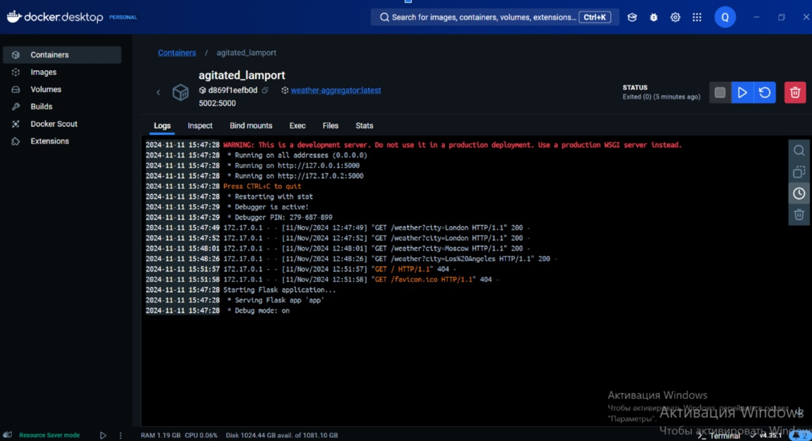
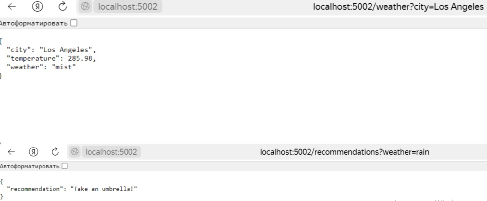

# Лабораторная работа №2 
## Weather-aggregator
### Цель работы:
-Научиться разрабатывать микросервисы с использованием Flask и WSGI.
-Применить многопроцессность для повышения производительности сервисов.
-Научиться упаковывать приложения в Docker-контейнеры.
-Освоить развёртывание serverless-приложений в Yandex Cloud.

### Структура проекта:
app.py — основной файл приложения с реализацией API.
Dockerfile — файл, содержащий инструкции для создания Docker-образа.
requirements.txt — файл с зависимостями для Python-проекта (например, Flask и requests).

#### app.py
Файл app.py содержит основной код приложения, написанного на Flask. Оно реализует следующие маршруты:

/weather: принимает запрос с параметром city и возвращает текущую погоду для указанного города.
/recommendations: принимает параметр weather и на его основе предлагает рекомендацию.
/history: возвращает историю запросов к приложению.
/add_history: добавляет город в историю запросов.

### Процесс сборки и запуска контейнера локально:
Для запуска контейнера на локальном компьютере выполнены следующие команды в терминале:

#### Сборка Docker-образа:
bash:
docker build -t weather-aggregator .

#### Запуск контейнера:
bash:
docker run -p 5002:5000 weather-aggregator

### Приложение будет доступно по адресу http://localhost:5002. Пример запроса: http://localhost:5002/weather?city=London.

### Загрузка Docker-образа на Docker Hub:
Docker-образ приложения был загружен на Docker Hub, и он доступен по следующей ссылке:
https://hub.docker.com/repository/docker/quimoriz/weather-aggregator/general

Для загрузки образа использовались команды:
bash:
docker tag weather-aggregator quimoriz/weather-aggregator:latest
docker push quimoriz/weather-aggregator:latest

### Тестирование проводилось с помощью следующих запросов:

Проверка погоды:
http://localhost:5002/weather?city=Moscow
Получение рекомендации:
http://localhost:5002/recommendations?weather=rain
Просмотр истории запросов:
http://localhost:5002/history

### Выводы
В ходе выполнения лабораторной работы были приобретены навыки разработки микросервисного приложения и контейнеризации с использованием Docker. Были изучены особенности настройки API.

### Приложение
Ссылка на Docker Hub: 
https://hub.docker.com/repository/docker/quimoriz/weather-aggregator/general

### Скриншоты:

